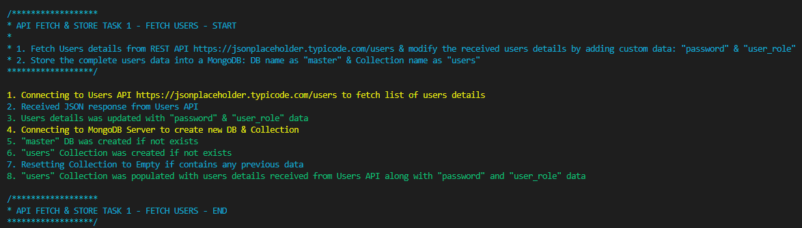
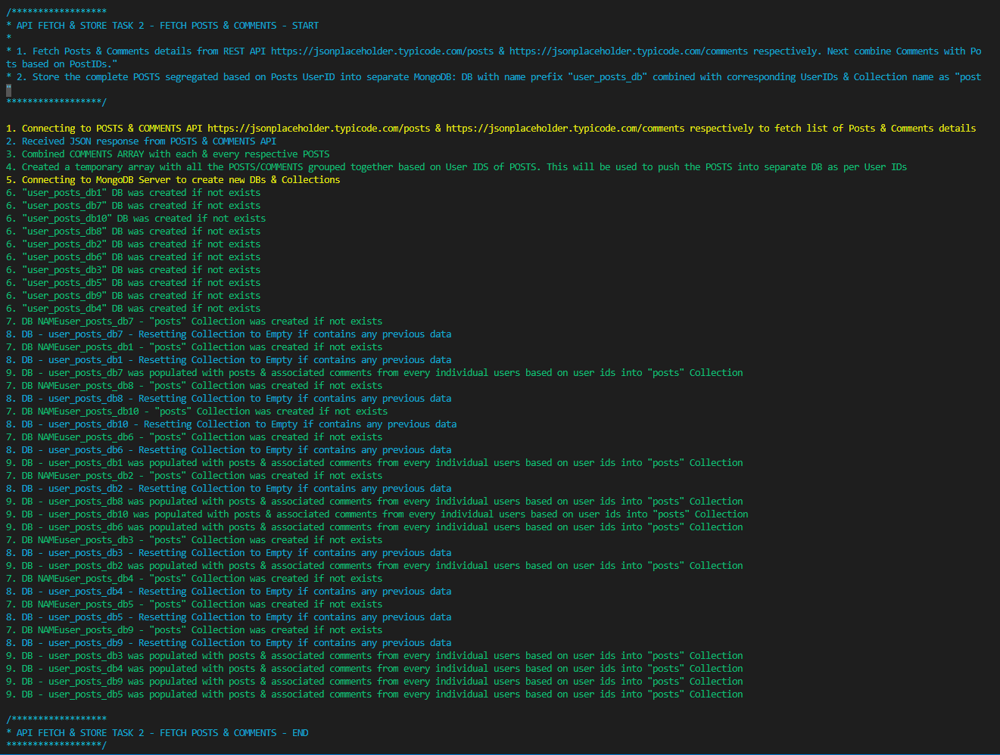

# <u>Secure NodeJS JSON API & Services</u> 

### Technology used: NodeJS (typescript), Express and MongoDB 


### Steps to run this project:-

> ##### Step 1:
>
> Clone/Download this repository's latest source into your local system & extract the package contents into a development folder.


> ##### Step 2:
>
> Run below command in a command line tool within root directory of this project folder to download all the defined script modules & node modules dependencies defined in the `package.json` file & make the project ready to run.

```
>> npm install
```


> **** VERY IMPOTANT NOTE: To fix node_modules installation errors ****
>
> - This project was built on a Windows machine & the `package-lock.json` was created with reference to Windows machine.
> - If you may come across any error when you run above command `npm install` then its recommended to remove `node_modules` folder if exists & even remove `package-lock.json` file to reset errors.
> - Once you finish removing unnecessary(issue causing) folders & files, then again run command `npm install` . This time it finishes installing all necessary node modules without any error.


> **Step 3:**  **** **VERY IMPORTANT STEP**  ****
>
> - Please create a new file `.env` in the root of the project folder. Example `.env example` file is provided with all the environment variables & MongoDB configuration details which needs to be updated in order to make this project to run without any errors.
> - Please make sure to read all the comments mentioned in every file to gain more details about each & every code block.
> - The whole project is designed in such a modular way using environment variables, that you can modify all kind of variables to change the way PORT number is assigned, MongoDB assigned, DB, Collections & many other things 


> **Step 4:**   **** **VERY IMPORTANT STEP**  ****
>
> - Please make sure to enter MongoDB connection URL either `local` or `remote`.
> - Please follow the MongoDB connection URL pattern specified in the `.env` file to provide correct pattern connection URL to avoid any kind of DB related issues.


------


### <u>Script 1:</u>

#### Script Name: Fetch & Store Users JSON Data Service

#### Script Details:

> 1) The Script to run as a separate service.
>
>  a) Write a script to fetch the users from. https://jsonplaceholder.typicode.com/users and save them in DB(DB_NAME: master, collection: users).
>
>  i) Also, add a default password for each user that can be used for login.
>
>  ii) Add user role(user can be either admin or viewer)


> Run below command in command line within root of Project Directory before running any of the below commands for first to transpile all Typescript into JavaScript into "dist" directory.

```node command line
>> npm run build
```


> Run below command in command line within root of Project Directory to initialize Script 1: Fetch & Store Users JSON Data Service.
>
> - The script is designed in such a way, that it shows the status of script processing in each & every stage in the Console.

```node command line
>> npm run service-fetch-users
```





------


### <u>Script 2:</u>

#### Script Name: Fetch & Store POSTS & COMMENTS JSON Data Service

#### Script Details:

> 1) The Script to run as a separate service.
>
>  b) Write a script to fetch posts and comments from https://jsonplaceholder.typicode.com/posts and https://jsonplaceholder.typicode.com/comments respectively.
>
>  i) Map comments to the posts as an array. Based on the `userId`, the post will be added to its respective user DB (collection=posts).
>
>  **Note:** One DB per user and each user DB will have posts collection.
>
>  **For example:** There are 3 users: A, B, C There Should be 3 DBs: A. B, C and each should have collection 'posts'.


> Run below command in command line within root of Project Directory before running any of the below commands for first to transpile all Typescript into JavaScript into "dist" directory.

```node command line
>> npm run build
```


> Run below command in command line within root of Project Directory to initialize Script 2: Fetch & Store POSTS & COMMENTS JSON Data Service.
>
> - The script is designed in such a way, that it shows the status of script processing in each & every stage in the Console.

```node command line
>> npm run service-fetch-posts
```





------


### REST APIs Implementation:


> Run below command in command line within root of Project Directory to transpile Typescript to JavaScript into "dist" folder. Once transpile finishes, it automatically Runs the API Server/Project which is available on the port number mentioned in `.env` file.

```node command line
>> npm start
```


> At first I implemented Login/Logout functionality & Secure APIs using JWT, Controllers, Middleware using JavaScript. Then tried to convert it to Typescript. But Couldn't finish it in less time.
>
> Need some more time to do Research & implement complete requirement in Typescript (missing - Login/Logout, Secure API & Access Control)


> #### <u>**API Endpoints:**</u>
>
> ##### a) Create a Rest API to fetch all users. (API to be accessed only by Admin)
>
> 1. http://localhost:3000/api/v1/users
>
>    
>
>
> ##### b) Create a Rest API to fetch user details.
>
> 2. http://localhost:3000/api/v1/users/:userID
>     (:userID is the ID of the user which ranges between 1 to 10 as per the Users API)
>
>   
>
>
> ##### c) Create a Rest API to fetch all posts (API to be accessed only by Admin)
>
> 3. http://localhost:3000/api/v1/posts
>
>    
>
>
> ##### d) Create a Rest API to fetch user posts
>
> 4. http://localhost:3000/api/v1/posts/user/:userID
> (:userID is the ID of the user which ranges between 1 to 10 as per the Users API)
> (This API fetches all the Posts & associated Comments stored in separate DB as per each individual user ID specified through :userID)
